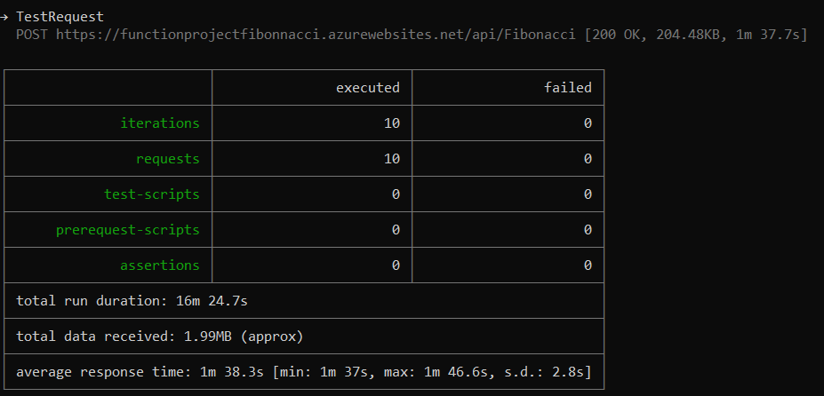
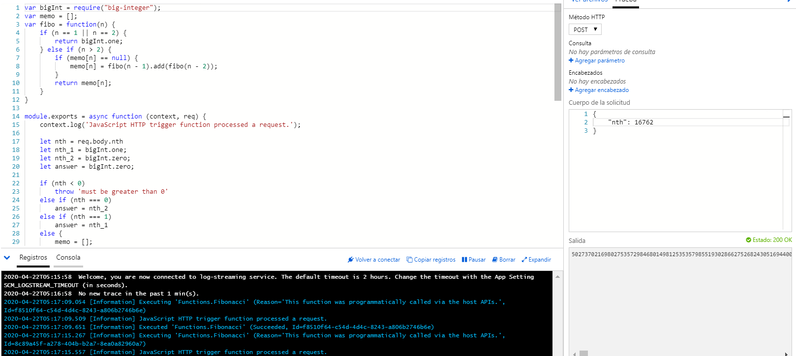

### Escuela Colombiana de Ingeniería
### Arquitecturas de Software - ARSW

## Integrantes

- **Juan Alberto Mejía Schuster**
- **Johann Sebastian Páez Campos**

## Escalamiento en Azure con Maquinas Virtuales, Sacale Sets y Service Plans

### Dependencias
* Cree una cuenta gratuita dentro de Azure. Para hacerlo puede guiarse de esta [documentación](https://azure.microsoft.com/en-us/free/search/?&ef_id=Cj0KCQiA2ITuBRDkARIsAMK9Q7MuvuTqIfK15LWfaM7bLL_QsBbC5XhJJezUbcfx-qAnfPjH568chTMaAkAsEALw_wcB:G:s&OCID=AID2000068_SEM_alOkB9ZE&MarinID=alOkB9ZE_368060503322_%2Bazure_b_c__79187603991_kwd-23159435208&lnkd=Google_Azure_Brand&dclid=CjgKEAiA2ITuBRDchty8lqPlzS4SJAC3x4k1mAxU7XNhWdOSESfffUnMNjLWcAIuikQnj3C4U8xRG_D_BwE). Al hacerlo usted contará con $200 USD para gastar durante 1 mes.

### Parte 0 - Entendiendo el escenario de calidad

Adjunto a este laboratorio usted podrá encontrar una aplicación totalmente desarrollada que tiene como objetivo calcular el enésimo valor de la secuencia de Fibonnaci.

**Escalabilidad**
Cuando un conjunto de usuarios consulta un enésimo número (superior a 1000000) de la secuencia de Fibonacci de forma concurrente y el sistema se encuentra bajo condiciones normales de operación, todas las peticiones deben ser respondidas y el consumo de CPU del sistema no puede superar el 70%.

### Escalabilidad Serverless (Functions)

1. Cree una Function App tal cual como se muestra en las  imagenes.

2. Instale la extensión de **Azure Functions** para Visual Studio Code.

3. Despliegue la Function de Fibonacci a Azure usando Visual Studio Code. La primera vez que lo haga se le va a pedir autenticarse, siga las instrucciones.

4. Dirijase al portal de Azure y pruebe la function.

5. Modifique la coleción de POSTMAN con NEWMAN de tal forma que pueda enviar 10 peticiones concurrentes. Verifique los resultados y presente un informe.

6. Cree una nueva Function que resuleva el problema de Fibonacci pero esta vez utilice un enfoque recursivo con memoization. Pruebe la función varias veces, después no haga nada por al menos 5 minutos. Pruebe la función de nuevo con los valores anteriores. ¿Cuál es el comportamiento?.

Gracias a la memorización mejora el rendimiento debido a que cuando se consulta un número menor, como este se guarda en memoria, al realizar una consulta mayor es menos costoso, llegando incluso a ser constante en peticiones de números menores.

**Preguntas**

* ¿Qué es un Azure Function?

Azure Functions permite ejecutar pequeñas piezas de código (llamadas "funciones") sin preocuparse por la infraestructura de la aplicación. Con Azure Functions, la infraestructura de la nube proporciona todos los servidores actualizados que se neceitan para mantener la aplicación funcionando a escala.

Una función es "disparada" por un tipo específico de evento. Entre los desencadenantes compatibles se incluyen la respuesta a cambios en los datos, la respuesta a mensajes, la ejecución en un horario o como resultado de una solicitud HTTP.

* ¿Qué es serverless?

La computación sin servidores es un modelo de ejecución de la computación en nube en el que el proveedor de la nube ejecuta el servidor y administra dinámicamente la asignación de los recursos de la máquina. La fijación de precios se basa en la cantidad real de recursos consumidos por una aplicación, y no en unidades de capacidad precompradas.

* ¿Qué es el runtime y que implica seleccionarlo al momento de crear el Function App?

Runtime: El runtime de las Azure functions proporciona una forma de experimentar las Azure functions antes de comprometerse con la nube. De esta manera, las partes de código que construyas pueden ser llevados contigo a la nube cuando migres. El tiempo de ejecución también abre nuevas opciones.

Implica que parte de la aplicacion se va a correr en maquinas locales, esto puede ser útil para enviar datos de forma condicional a otros sistemas, para ejecutar procesos por lotes durante la noche entre otros.

* ¿Por qué es necesario crear un Storage Account de la mano de un Function App?

Una cuenta de almacenamiento Azure contiene todos los objetos de datos de Azure Storage: blobs, archivos, colas, tablas y discos. La cuenta de almacenamiento proporciona un espacio de nombres único para sus datos de Azure Storage al que se puede acceder desde cualquier lugar del mundo a través de HTTP o HTTPS.

Va de la mano con Functions porque se conectan mediante triggers y bindings que permiten a las functions reaccionar a los cambios en blobs.

* ¿Cuáles son los tipos de planes para un Function App?, ¿En qué se diferencias?, mencione ventajas y desventajas de cada uno de ellos.

Azure ofrece dos formas de cobrar:

La primera es directamente cobrar el consumo de las functions mediante dos planes

  Cobro por consumo: Incluye una subvención mensual gratuita de 1 millón de solicitudes y 400.000 GB-s de consumo de recursos por mes por suscripción en el precio de pago por uso en todas las aplicaciones de funciones en esa suscripción.

  | Métrica | Precio | Gratis (por mes)|
  |:--- | :---: | :---: |
  | Tiempo de ejecución | $0.000016/GB-s | 400,000 GB-s |
  | Total de ejecuciones | $0.20 por millón ejecuciones | 1 million ejecuciones |

  Cobro premium: El plan Premium de Azure Functions proporciona un rendimiento mejorado y se factura por segundo en función del número de vCPU-s y GB-s que consumen sus funciones

  | Métrica | Precio | 
  |:--- | :---: |
  | vCPU duration | vCPU: $0.173 vCPU/hour |
  | Memory duration |  	Memory: $0.0123 GB/hour |
  
  Las diferencias son que el plan de consumo cobra por número de eventos y cuanto duran, el cobro premium cobra es por recursos usados y ofrece un mejor rendimiento 
  
las ventajas dependen del uso que se le vayan a dar a las functions, si mi aplicación va a tener muchos usuarios por hora haciendo tareas muy pequeñas es mejor el cobro premium pero si voy a tener un tráfico más o menos pequeño es mejor el cobro por consumo. Otro factor a tener en cuenta es el rendimiento mejorado del plan premium.

La segunda forma es adquiriendo un plan, estos son los planes que ofrece y sus caracteristicas

|     | Free | Shared | Basic | Standar | Premium | Isolated |
|:--- | :---:| :---:  | :---: | :---:   | :---:   | :---:    |
|Web, mobile, or API apps | 10 | 100 | Unlimited  | Unlimited  | Unlimited | Unlimited |
|Disk space | 1 GB | 1 GB | 10 GB | 50 GB | 250 GB | 1 TB |
|Custom domain | - | Supported | Supported | Supported | Supported | Supported |
|Auto Scale | - | - | - | Supported | Supported | Supported |  
|VPN hybrid connectivity | - | - | - | Supported | Supported | Supported |  
|Price | Free | $0.013/hour | $0.075/hour | $0.10/hour | $0.20/hour | $0.40/hour |

Escoger que plan es mejor se reduce al objetivo con el que se va a usar:

Free, shared y Basic son mas para la etapa de desarrollo, para hacer pruebas. Por esto es que sus capacidades son limitadas y el costo no es alto.

Standar es lo que la mayoria de gente usaria para una aplicacion que ya está en producción.

Los siguientes planes ya son para casos especificos donde se busca un mejor desempeño y/o mayor seguridad 

* ¿Por qué la memoization falla o no funciona de forma correcta?

La memorización falla o no funciona correctamente debido a que esta funcion de llamado recursivo tiene un límite de iteraciones o llamados recursivos que puede hacer y aún con la memorización es costoso realizar esta operación, llegando a colapsar o fallar en algún caso muy grande.

* ¿Cómo funciona el sistema de facturación de las Function App?

Las funciones se facturan sobre la base del consumo de recursos observado, medido en gigabytes-segundos (GB-s). El consumo de recursos observado se calcula multiplicando el tamaño medio de la memoria en gigabytes por el tiempo en milisegundos que se tarda en ejecutar la función. La memoria utilizada por una función se mide redondeando al alza los 128 MB más cercanos, hasta el tamaño máximo de memoria de 1.536 MB, y el tiempo de ejecución se calcula redondeando al alza los 1 ms más cercanos. El tiempo mínimo de ejecución y la memoria para la ejecución de una sola función es de 100 ms y 128 mb respectivamente.

* Informe

Si ejecutamos las funciones alojadas en azure, podemos evidenciar que no soporta grandes casos, en el caso 1000000 la función ya no funcionaba mientras que en la versión iterativa si. Esto se debe a que la función iterativa no tiene la restricción del número de iteraciones y la función recurrente si.
Pero gracias a la memorización, se puede evidenciar un mejor rendimiento en los casos vistos ya que este al consultar un número, puede hacer uso de los guardados anteriormente, ahorrando procesamiento y tiempo. Lo malo de esto es que como la función recursiva tiene un número máximo de llamados recursivos, no puede llegar a hacer grandes casos como fibonacci (1000000) mientras que la función iterativa si.
